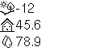

# BSBmonCR
**BSB-LAN monitor by user -cr**

Monitoring some heating related parameters via [BSB-LAN](https://github.com/fredlcore/bsb-lan),
using an esp32 board (optionally) fitted with an ssd1306 display.
 
*Inspired by (https://forum.fhem.de/index.php/topic,110599.0.html).*

This work is licensed under a
[Creative Commons Attribution-NonCommercial-ShareAlike 4.0 International License](http://creativecommons.org/licenses/by-nc-sa/4.0/).

## How To Use

Copy `config.h.default` to `config.h` and edit `config.h` according to your needs:
WiFi credentials must be adjusted here; everything else is optional.
(You may also have/want to adjust the BSB parameters and values to fit your
heating system's configuration. Look for the `switch` statement in
`BSBmonCR.ino` and also adapt `BSB-LAN/BSB_LAN_custom_global.h` accordingly.)
Then compile `BSBmonCR.ino` and install it on your esp32 to be used as a monitor.

Put the files from the `BSB-LAN` sub-directory into your BSB-LAN sketch directory
and don't forget to put `#define CUSTOM_COMMANDS` into `BSB_LAN_config.h`,
then (re-) compile `BSB-LAN.ino` and install it on the unit attached to your BSB.
(I've been using BSB-LAN version 2.1.3-20220209235153, btw.)

If all goes well, you should see data from your BSB-LAN system displayed
on the BSBmonCR unit.

## Functionality

### Display Contents

Outside, room and water temperature (current value and preceding 24 h plot)
are displayed. There's also a thin line below the temperature plots, showing
when the boiler was active.
The house/water symbol is filled when the house/water is being heated.
  
Upon power-up, the monitor will display placeholder values for the
temperatures, which should within seconds be replaced by values from your
BSB-LAN unit.

The plots on the right will take at least 20 minutes to begin to show,
longer when the average temperature in the first 20 minutes is the same
as in the currently running 20 minutes. Vertically, the plots scale
automatically to fully use the limited space available. They will look best
once the first 24 hours have elapsed and the plots take up their whole width.

### Screenshots via HTTP

Introduced with v0.2.0

You should also be able to display BSBmonCR screen contents
(even without an ssd1306 display attached) on any web browser in your network
by loading `http://<your-BSBmonCR-address>/`

### Presence Indicator

Introduced with v0.3.0 (first version on GitHub)

You can add a presence check for computer systems (e.g. cell phones, which
roughly translates to people) in your network. Note that for simplicity
reasons this has been implemented using ping, which is not the most
reliable method. If you are willing to sacrifice some display space for
this feature, `#define ADDR_TO_CHECK` in `BSBmonCR.ino`.

If activated, each of the systems monitored will take up a single pixel
row at the bottom of the screen, plus 0-2 empty lines above them (none
for the number of monitored systems being multiples of three (3/6/...),
one empty line for 2/5/8/... systems, two for 1/4/7/...).

### Logging to a Dropbox Account

Introduced with v0.4.0

Periodic saving of both screenshots (c.f. above) and log files to a
Dropbox account can be enabled in `config.h`. For this function to work,
read/write access permission must be granted to BSBmonCR; follow the
hint in `config.h` on how to do that.

The files saved will be named `yyyy-mm-dd.*`, with the files' basename
representing the current day. They will be updated as specified in
`config.h`. Screenshots are saved in Windows bitmap format (`*.bmp`),
data logs as comma separated value text files (`*.csv`) with a single
line for each minute, giving the timestamp (hh:mm) and the values for
the logged parameters at that time. The values are logged as
received via UDP, i.e. temperatures are multipled by ten
(e.g. `20.1 °C` will be logged as `201`). For simplicity reasons,
the CSV files will not contain a heading for the column names!

BSBmonCR's `*.csv` files can be plotted using `BSBmonCR_log_viewer.html`.

Should you wish to view multiple log files combined, create a compiled
file by concatenating the original files, with each line prefixed with
the orignal file's basename and a space. One way to do this is by using
the following command:
`perl -pe '($x=$ARGV)=~s/\..+/ /;s/^/$x/' ????-??-??.csv >combined.csv`[^1]

[^1]: That is, if you're on Unix. for Windows, use
`perl -pe "BEGIN{@ARGV=map{glob}@ARGV}($x=$ARGV)=~s/\..+/ /;s/^/$x/" ????-??-??.csv >combined.csv`
instead to expand the `?` wildcards. Perl is [free](https://perl.org) software.

## Notes

### Code Comments

* BSB-LAN parameters used are hardcoded in multiple places
  (`BSB-LAN/BSB_LAN_custom_global.h`, `BSBmonCR.ino`, `BSBmonCR_log_viewer.html`). 
* In most places, screen coordinates are hard-coded for a 128*64 display,
  not calculated to fit a screen with possibly differing dimensions.
* Error handling in some cases may not be considered "production ready".
* Coding stile is not always consistent (e.g. usage of `String` vs. `char*`).
* In serving screenshots, HTTP handling is pragmatic, not polite.
* Code comments are limited to what I personally have found useful
  (e.g. no comment blocks introducing functions, ...).

### Known Issues

* Presence indication via ping is not always reliable
  (e.g. some cell phones' power savings functions may interfere).
* The `NTPClient` libary used doesn't validate its deliverables,
  which sometimes leads to wrong values for both date and time;
  this will then lead to surprising file names in dropbox logging,
  e.g. `2036-02-07.*`. To alleviate the effects of such events (which
  usually should be fixed after one minute), existing `*.csv` files
  will be read and continued when switching to a new `yyyy-mm-dd`.
  (This measure also limits log data loss when restarting your
  BSBmonCR unit.)
* I would have liked to have `BSBmonCR_log_viewer.html` use the full
  browser window height, but couldn't figure out how to do that.
  (Please let me know if you do!)
