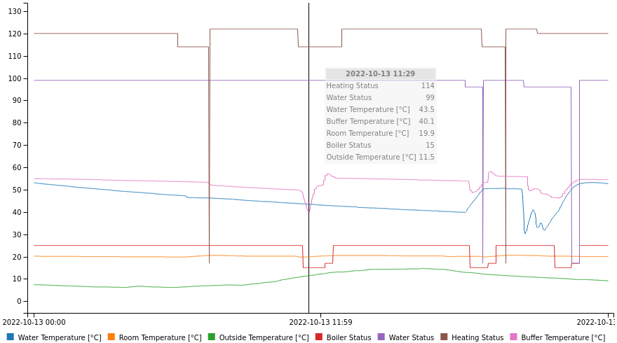

# BSBmonCR
**BSB-LAN monitor by user -cr**

Monitoring some heating related parameters via [BSB-LAN](https://github.com/fredlcore/bsb-lan),
using an esp32 board (optionally) fitted with an ssd1306 display.
 
*Inspired by (https://forum.fhem.de/index.php/topic,110599.0.html).*

This work is licensed under a
[Creative Commons Attribution-NonCommercial-ShareAlike 4.0 International License](http://creativecommons.org/licenses/by-nc-sa/4.0/).

## How To Use

### Server (BSB-LAN)

#### Variant 1: Without Custom Code

Introduced with v0.7.0

This requires [BSB-LAN](https://github.com/fredlcore/bsb-lan) source  code from 2022-08-20 or newer!

Enable UDP logging in BSB-LAN's configuration (URL command `/C`),
with a log interval of ten seconds (recommended; other values up to about 55s should
also work without loss of functionality) and the log parameters used
in BSBmonCR's `config.h` (c.f. [below](#client-bsbmoncr)).

#### Variant 2: With Custom Code

Put the files from the `BSB-LAN` sub-directory into your BSB-LAN sketch directory
and don't forget to put `#define CUSTOM_COMMANDS` into `BSB_LAN_config.h`.
Adjust `BSBmonCR_config.h` contents,
then (re-) compile `BSB-LAN.ino` and install it on the unit attached to your BSB.
(I've been using BSB-LAN version ~~2.1.3-20220209235153~~ 2.1.8-20220731102301, btw.)

### Client (BSBmonCR)

Copy `config.h.default` to `config.h` and edit `config.h` according to your needs:
- WiFi credentials must be adjusted here;
- BSB parameters may also need adjusting;
- for [server variant 2](#variant-2-with-custom-code) `#define UDP_PORT 28000`;
- everything else is optional.
Then compile `BSBmonCR.ino` and install it on your esp32 to be used as a monitor.

If all goes well, you should see data from your BSB-LAN system displayed
on the BSBmonCR unit.

## Functionality

### Display Contents

(For examples, see [below](#example-images).)

Outside, room and water temperature (current value and preceding 24 h plot)
are displayed. There's also a thin line below the temperature plots, showing
when the boiler was active.
The house/water symbol is filled when the house/water is being heated (half
filled when the boiler is not running, e.g. because the boiler is in overrun
or a [buffer](#buffer-temperature) is used).
  
Upon power-up, the monitor will display placeholder values for the
temperatures, which should within seconds be replaced by values from your
BSB-LAN unit.

The plots on the right will take at least 20 minutes to begin to show,
longer when the average temperature in the first 20 minutes is the same
as in the currently running 20 minutes. Vertically, the plots scale
automatically to fully use the limited space available. They will look best
once the first 24 hours have elapsed and the plots take up their whole width.

#### Presence Indicator

Introduced with v0.3.0 (first version on GitHub)

You can add a presence check for computer systems (e.g. cell phones, which
roughly translates to people) in your network. Note that for simplicity
reasons this has been implemented using ping, which is not the most
reliable method. If you are willing to sacrifice some display space for
this feature, `#define ADDR_TO_CHECK` in `config.h`.

If activated, each of the systems monitored will take up a single pixel
row at the bottom of the screen, plus 0-2 empty lines above them (none
for the number of monitored systems being multiples of three (3/6/...),
one empty line for 2/5/8/... systems, two for 1/4/7/...).

#### Nerdy Timestamp

Introduced with v0.5.0

With `#define WITH_NERDY_TIMESTAMP_DISPLAY` in `config.h`, a binary
encoding of the current date and time will be displayed to the left
of the boiler status line. Note that this display will only be
updated when BSBmonCR either receives data via UDP, updates one of
the presence indicators (if configured), or advances the rolling
plots.

Use `perl Decode_nerdy_timestamp_in_BSBmonCR_screenshot.pl`
(from the `tools` directory) to
decode the timestamp in bitmaps received from BSBmonCR, either
providing a bitmap file name as an argument to this script,
or feeding it such content directly, e.g. by prepending the following
to the command above: `wget -qO- BSBmonCR |` (i.e. if `BSBmonCR` is the
name of your BSBmonCR system in your network; replace with the right
name or IP address, if necessary).

#### Buffer Temperature

Introduced with v0.8.0

With a heating buffer configured, its temperature values are
included in [logging](#logging-to-a-dropbox-account) (if enabled),
and a vertical line is placed to the left of the 24 hours plots.
Its height shows the current buffer temperature relative to its
minimal and maximal values within the most recent 24 hours (e.g.
50 percent height = halfway between min and max).

Introduced with v0.8.3

As an alternative to the relative scaling described above, a fixed
scale can also be selected for the buffer temperature in `config.h`.

#### Solar Power Display

Introduced with v0.9.0

If you have a small solar energy system registered with nepviewer.com
you can also have its most[^0] recent power report displayed by setting
`PV_IDENT` in `config.h`.

[^0]: It's actually _fairly_ recent, depending on `PV_UPDATE_INTERVAL`
in `BSBmonCR.ino`.

That value will then be displayed as a vertical line to the very left
of the screen, scaled for 10 Watts per pixel, in bars of 10 pixels, i.e.
100 Watts for each full bar. (If your solar system does more than 600
Watts, you may want to adjust the scaling in `BSBmonCR.ino`.)

Introduced with v0.9.3

Additionally, the current day's energy generation will be
displayed as a horizontal bar in the top line, scaled for 100 Wh
per pixel, in bars of 10 pixels, i.e. 1 kWh for each full bar.
(Again, depending on your solar system's capacity, you may want to
adjust the scaling in `BSBmonCR.ino`.)

### Screenshots via HTTP

Introduced with v0.2.0

You should also be able to display BSBmonCR screen contents
(even without an ssd1306 display attached) on any web browser in your network
by loading `http://<your-BSBmonCR-address>/`

### Logging to a Dropbox Account

Introduced with v0.4.0

Periodic saving of both [screenshots](#screenshots-via-http) and log files
to a Dropbox account can be enabled in `config.h`. For this function to work,
read/write access permission must be granted to BSBmonCR; to achieve
this, load `Get_Dropbox_token_for_BSBmonCR.html` (from the `tools`
directory) in your web browser and follow the instructions.

The files saved will be named `yyyy-mm-dd.*`, with the files' basename
representing the current day. They will be updated as specified in
`config.h`. Screenshots are saved in Windows bitmap format (`*.bmp`),
data logs as comma separated value text files (`*.csv`) with a single
line for each minute, giving the timestamp (hh:mm) and the values for
the logged parameters at that time. The values are logged as
received via UDP, i.e. temperatures are multiplied by ten
(e.g. `20.1 °C` will be logged as `201`). For simplicity reasons,
the CSV files will not contain a heading for the column names.

To limit log data loss when restarting your BSBmonCR unit,
existing `*.csv` files will be read and continued when switching
to a new `yyyy-mm-dd`. Performing an [OTA Update](#ota-update) will
force `*.csv` writing immediately before the device's reset and reload
the data from the file and continue it after the reset.

#### Data Log Viewing

BSBmonCR's `*.csv` files can be plotted using `BSBmonCR_log_viewer.html`
(from the `tools` directory),
which provides exact readings of a sample set's values (by hovering
over the plot), zoom (mouse wheel / pinch) and scroll (drag)
functionality as well as data line highlighting / disabling (hover
over / (alt-) click on line enty in legend).

Should you wish to view multiple log files combined, create a compiled
file by concatenating the original files, with each line prefixed with
the orignal file's basename and a space. One way to do this is by using
the following command:
`perl -pe '($x=$ARGV)=~s/\..+/ /;s/^/$x/' ????-??-??.csv >combined.csv`[^1]
As these combined files may overload `BSBmonCR_log_viewer.html` (especially
with a complete month's data or even more), you may want to create
reduced versions for display, e.g. by removing all but the
minute-is-divisible-by-ten data lines through processing the files with
`perl -ne 'print if /:.0,/'`.[^2]

[^1]: That is, if you're on Unix. For Windows, use
`perl -pe "BEGIN{@ARGV=map{glob}@ARGV}($x=$ARGV)=~s/\..+/ /;s/^/$x/" ????-??-??.csv >combined.csv`
instead to expand the `?` wildcards. Perl is [free](https://perl.org) software, btw. :)

[^2]: On Windows, use double quotes instead of single quotes.

### OTA Update

Introduced with v0.6.0

By loading `http://<your-BSBmonCR-address>:8080/` in your web browser,
you can update you BSBmonCR's software "over the air" (OTA).
There you can upload a file created via `Sketch -> Export compiled binary file...`
in the Arduino IDE. (Of course this works only with an esp32 already
running OTA enabled software, i.e. the first time you have to load the
BSBmonCR software onto your esp32 via USB.)

## Example Images

Animated (and obviously sped up) display progress in full featured
(minus [solar power display](#solar-power-display)) configuration:

Example data log (see [above](#logging-to-a-dropbox-account) for information on
how to create these):

Status values are given as provided by
[BSB-LAN](https://github.com/fredlcore/bsb-lan).[^3]

[^3]: For an explanation of the status values, use `http://bsb-lan/E8001` etc.
(replace `bsb-lan` with your BSB-LAN system's network address).

Corresponding BSBmonCR screen contents (enlarged and color coded for explanation /
correlation to log view above):

The screen example shows [presence indication](#presence-indicator)
for four cell phones configured (bottom four "pixel" lines),
as well as [timestamp encoding](#nerdy-timestamp) enabled (light
blue bit pattern[^4]).

Enlarged and color coded (for explanation) example with fixed scale for the (optional)
[buffer temperature](#buffer-temperature)
(blue, 10 °C to each full vertical bar, 49 °C here)
and (also optional) [solar power display](#solar-power-display)
(most recent power reading in red, 100 W to each full vertical bar, 520 W here,
and current day's energy total in green, 1 kWh to each full horizontal bar, 2.4 kWh here).

[^4]: `-----XXX XXX--XX-` = 2022, `----X-X-` = 10, `----XX-X` = 13,
`--------` = 0, `--------` = 0, `----X--X` = 9 (with a line
below to mark the LSB (least significant bit) of each byte
-> 2022-10-13T00:00:09 :)

Naked esp32 fitted with ssd1306 display:

Wall mounted BSBmonCR system (I'm lacking the tools to fit the display *in* the case):

## Notes

### Coding

* In most places, screen coordinates are hard coded for a 128*64 display,
  not calculated to fit a screen with possibly differing dimensions.
* Error handling in some cases may not be considered "production ready".
* Coding style is not always consistent (e.g. usage of `String` vs. `char*`).
* In serving screenshots, HTTP handling is pragmatic, not polite.
* Code comments are limited to what I personally have found useful
  (e.g. no comment blocks introducing functions, ...).

### Known Issues

* Presence indication via ping is not always reliable
  (e.g. some cell phones' power saving functions may interfere).
* The NTPClient library used is broken, but the workaround implemented
  here seems to suffice.
